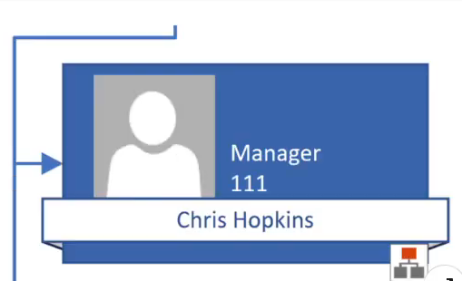

#### Q13. What does the icon in the lower-right corner of the organizational shape indicate?

---

- [ ] Belt shape

---

- [x] hidden subordinates

---

- [ ] synchronized copy

---

- [ ] executive position
